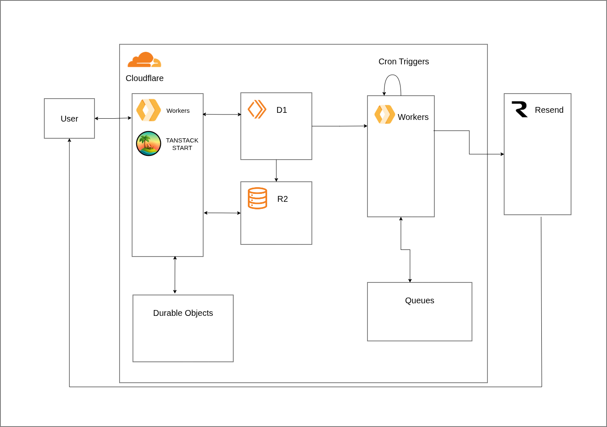

# 全体アーキテクチャ



Cloudflare 上で動く Web アプリ (TanStack Start) と、メール送信用のワーカー (リマインド、共有の通知) の 2 つの Worker で構成する。ブランチや PR の動作確認には、Web アプリの Worker Previews (ブランチごとのプレビュー) を使う ([デプロイとプレビュー](deploy.md))。

図は大まかなもので、共有の通知用のキュー (`kanban-notifications`) などは描いていない。

## コンポーネント

| コンポーネント                   | 役割                                                                                             | 状態                                                                                                |
| -------------------------------- | ------------------------------------------------------------------------------------------------ | --------------------------------------------------------------------------------------------------- |
| Workers (`apps/web`)             | 画面、タスク API、認証                                                                           | 実装済み → [Web アプリ仕様](web-app.md)                                                             |
| Workers (`apps/reminder-worker`) | cron で起動してリマインドを Queues に積み、リマインドと共有の通知のメールを送る                  | 実装済み。送信の設定は [#8](https://github.com/ut-code/kanban/issues/8) → [ワーカー仕様](worker.md) |
| D1                               | ユーザー、セッション、タスク (本文、順番を含む)、添付のメタデータ、共有と招待の保存              | 実装済み → [テーブル定義](database.md)                                                              |
| Cron Triggers                    | リマインド Worker を 15 分ごとに起動                                                             | 実装済み                                                                                            |
| Queues                           | メールの送信キュー (リマインド用の `kanban-reminders` と、共有の通知用の `kanban-notifications`) | 実装済み                                                                                            |
| Resend                           | リマインドと共有の通知のメールの送信                                                             | コードあり。API キーとドメインの設定は未了                                                          |
| R2                               | タスクのファイル添付                                                                             | 実装済み (`FILES`) → [Web アプリ仕様](web-app.md)                                                   |
| Durable Objects                  | 共有したタスクの変更をリアルタイムに通知 (WebSocket)                                             | 実装済み (`COLLABORATION`) → [Web アプリ仕様](web-app.md)                                           |

## リポジトリ構成

```
apps/
  web/                 画面、HTTP ハンドラ、認証
    src/lib/           純粋な関数 (入力検証、整形、順番、ステータスなど)。テストあり
    src/server/        Worker 側の処理 (認証、タスク、添付、共有、通知の API)
    src/components/    画面の部品 (ボード、カード、本文のエディタなど)
  reminder-worker/     cron のリマインド処理と、メールの送信 (リマインド、共有の通知)
packages/
  db/                  Drizzle のスキーマ、マイグレーション、D1 リポジトリ、共有する型
e2e/                   Playwright のテスト (本物のブラウザで動かす)
docs/                  このドキュメント
```

- 2 つの Worker が共有するのは DB のコードと型だけなので、`packages/` は `db` の 1 つにしている。
- 純粋な関数は `apps/web/src/lib/` に置き、ユニットテストを書く。ハンドラはインメモリ SQLite を使って通しでテストする。

## データの流れ

- **タスク操作:** ブラウザ → `apps/web` の `/api/tasks` → D1。リクエストごとにセッションを確認し、ログインしていなければ 401 を返す。
- **リアルタイム通知:** タスクの変更後、`apps/web` が、そのタスクを見られる全員の Durable Object に通知する。各ブラウザは WebSocket でつながり、通知を受けると一覧を取得し直す。
- **共有の通知メール:** タスクを共有すると、`apps/web` が `kanban-notifications` に積み、`reminder-worker` が Resend で送る。アカウントがない相手は招待として保存され、アカウントを作ると共有される。
- **リマインド:** Cron → `reminder-worker` が D1 から対象タスクを検索 → Queues に投入 → 同じ Worker のコンシューマが Resend でメール送信。

## ドキュメント一覧

- [Web アプリ仕様](web-app.md)
- [テーブル定義](database.md)
- [ワーカー仕様](worker.md)
- [デプロイとプレビュー](deploy.md)
- [開発](development.md)
